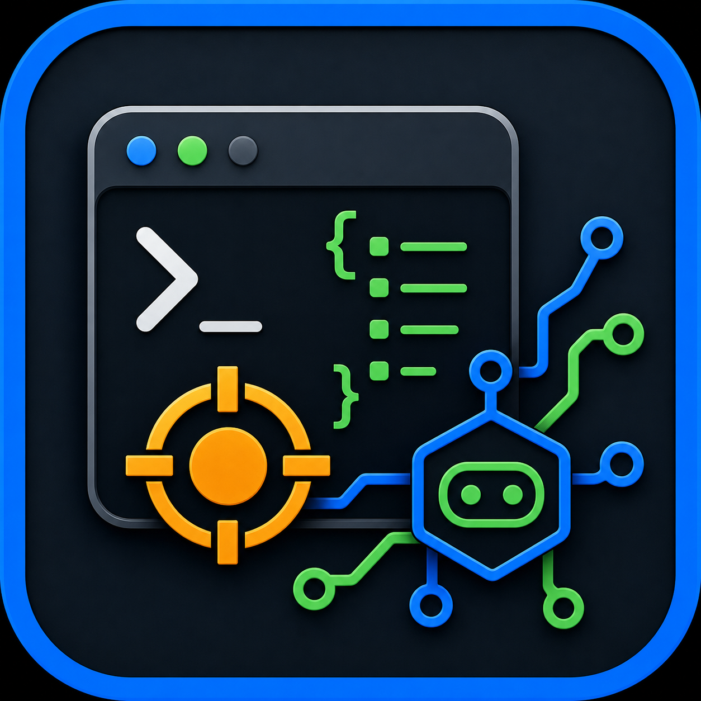

<p align="center">
  
</p>

<h1 align="center">GDB CLI for AI Agents</h1>

<p align="center">
  <em>Scriptable GDB sessions with structured JSON output for coding agents and automation.</em>
</p>

<p align="center">
  = 3.10">
  = 9.0">
  
  
</p>

`gdb-cli` wraps GDB in a small, agent-friendly command line interface. It keeps
debugging sessions alive across separate CLI calls, blocks until GDB returns to a
prompt, and returns JSON that agents and scripts can consume without scraping an
interactive terminal.

[Features](#features) - [Quick start](#quick-start) - [Usage](#usage) - [Commands](#commands) - [Architecture](#architecture) - [Agent skill](#agent-skill) - [Development](#development)

## Features

- **Persistent sessions** - start a session once, then reuse its `session_id` for
  later commands.
- **Structured output** - common GDB commands are parsed into JSON fields such as
  `frames`, `threads`, `registers`, and `breakpoints`.
- **Synchronous execution** - `run`, `continue`, `step`, `next`, and similar
  commands block until the target stops, exits, times out, or is interrupted.
- **Daemon-backed CLI** - the first CLI call starts `gdb-cli-server` automatically
  and communicates over a Unix domain socket.
- **Automation controls** - configurable command timeouts, output truncation, idle
  session cleanup, and explicit shutdown.

> [!NOTE]
> This project is designed for Linux environments where GDB and Unix domain
> sockets are available.

## Quick start

### Prerequisites

| Dependency | Version |
| --- | --- |
| Linux | required |
| Python | 3.10+ |
| GDB | 9.0+ |
| uv | recommended for installation and development |

### Install

```bash
git clone https://github.com/evanzlh/gdb-for-agent.git
cd gdb-for-agent
uv tool install .
```

The `gdb-cli` and `gdb-cli-server` commands will be installed as console scripts.
The `start` command starts the server daemon automatically if it is not already
running.

```bash
gdb-cli start
```

Example response:

```json
{
  "session_id": "a1b2c3d4",
  "status": "ready",
  "working_dir": "/path/to/project"
}
```

### Update

```bash
git pull
uv tool install . --reinstall
```

### Uninstall

```bash
uv tool uninstall gdb-cli
rm -rf ~/.gdb-cli
```

## Usage

### Basic debugging flow

```bash
# 1. Start a GDB session
gdb-cli start

# 2. Load a binary
gdb-cli command --session a1b2c3d4 "file ./my_app"

# 3. Set a breakpoint and run
gdb-cli command --session a1b2c3d4 "break main"
gdb-cli command --session a1b2c3d4 "run" --timeout 30

# 4. Inspect state
gdb-cli command --session a1b2c3d4 "bt"
gdb-cli command --session a1b2c3d4 "info locals"
gdb-cli command --session a1b2c3d4 "print argc"

# 5. Clean up
gdb-cli terminate --session a1b2c3d4
```

Parsed commands return structured JSON when possible:

```json
{
  "frames": [
    {
      "num": 0,
      "function": "main",
      "file": "main.c",
      "line": 10
    }
  ],
  "truncated": false
}
```

### Attach to a running process

```bash
gdb-cli start
gdb-cli command --session a1b2c3d4 "attach 12345"
gdb-cli command --session a1b2c3d4 "info threads"
gdb-cli command --session a1b2c3d4 "bt"
gdb-cli command --session a1b2c3d4 "detach"
gdb-cli terminate --session a1b2c3d4
```

> [!TIP]
> If a command is expected to run for a while, pass `--timeout <seconds>`.
> If it runs longer than expected, interrupt it with:
>
> ```bash
> gdb-cli command --session a1b2c3d4 "interrupt"
> ```

## Commands

| Command | Purpose |
| --- | --- |
| `gdb-cli start` | Start a new GDB session |
| `gdb-cli command --session <id> "<cmd>"` | Execute any GDB command |
| `gdb-cli status --session <id>` | Query one session |
| `gdb-cli sessions` | List active sessions |
| `gdb-cli terminate --session <id>` | Terminate one session |
| `gdb-cli shutdown --force` | Stop the daemon and terminate active sessions |

The default runtime directory and Unix socket live under `~/.gdb-cli/`.

### Structured output

| GDB command | Parsed output |
| --- | --- |
| `bt`, `backtrace`, `where` | `frames[]` with `num`, `function`, `file`, `line`, `address` |
| `info threads` | `threads[]` with `id`, `target_id`, `current`, `frame`, `state` |
| `print`, `p` | `var`, `value`, `type`, or raw `output` for GDB messages |
| `info registers` | `registers[]` with `name`, `value`, `raw_value` |
| `info breakpoints` | `breakpoints[]` with `num`, `type`, `enabled`, `address`, `what` |
| `info sharedlibrary` | `libraries[]` with `name`, `from`, `to`, `syms_read` |
| `disassemble` | `instructions[]` with `address`, `offset`, `asm` |
| Other commands | raw `output` |

By default, command output is capped at 10,000 characters. Use `--max-length` to
increase the limit when you need larger dumps.

> [!IMPORTANT]
> Do not send concurrent commands to the same session. Each session owns one GDB
> process and commands are handled synchronously. Create separate sessions for
> parallel debugging. The supported exception is `interrupt`, which is intended
> to stop a blocking command.

## Architecture

```text
AI agent / script
      |
      | gdb-cli start|command|status|sessions|terminate
      v
CLI layer
      |
      | JSON over Unix domain socket
      v
gdb-cli-server daemon
      |
      | pexpect
      v
GDB process
      |
      v
Target program
```

The daemon owns session state in memory and starts GDB with:

- `--quiet --nx`
- `set pagination off`
- `set confirm off`
- `TERM=dumb`

Idle sessions are cleaned up after 60 minutes by default. Configure this with
`GDB_CLI_IDLE_TIMEOUT` or `gdb-cli-server --idle-timeout <seconds>`.

## Agent skill

The repository includes a skill that teaches compatible agents how to use the CLI
for common debugging scenarios:

```text
skills/gdb-debugging/SKILL.md
skills/gdb-debugging/references/commands.md
```

Use it when an agent needs to debug C/C++ programs, inspect crashes, attach to a
running process, or analyze a core dump through `gdb-cli`.

## Development

Install dependencies:

```bash
uv sync
```

Run tests:

```bash
uv run pytest tests/ -v
```

The integration tests start `gdb-cli-server`, compile small test binaries, and
exercise real GDB sessions. They require GDB and a working C/C++ compiler.

## Troubleshooting

| Symptom | What to check |
| --- | --- |
| `Failed to start GDB RPC server` | Confirm `gdb-cli-server` is installed and available in `PATH` |
| `GDB not found in PATH` | Install GDB or make sure `gdb` is available in `PATH` before starting sessions |
| Command timed out | Increase `--timeout` or run `gdb-cli command --session <id> "interrupt"` |
| Attach is denied | Check Linux ptrace permissions, such as `/proc/sys/kernel/yama/ptrace_scope` |
| Output is truncated | Re-run with a larger `--max-length` or inspect a narrower expression |
